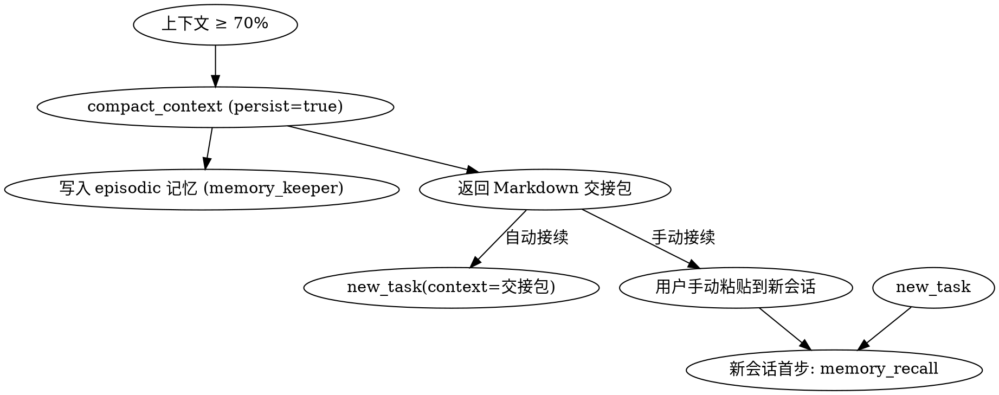

# Context Compactor · 会话压缩与交接

## 前置条件

- skills-mcp-server 已启动且 `compact_context` 工具可见
- 当前会话已积累足够上下文（通常超过窗口 60%）
- 任务尚未完成，需要在新会话延续

## 输入

`compact_context` 工具参数：

| 参数 | 类型 | 必填 | 说明 |
|------|------|------|------|
| objective | string | 是 | 当前任务最终目标（一句话） |
| progress_done | string[] | 否 | 已完成的关键里程碑 |
| progress_pending | string[] | 否 | 未完成待办，按优先级排 |
| key_decisions | string[] | 否 | 关键决策与依据，建议附 `[实测]/[源码]` 标注 |
| key_files | string[] | 否 | 涉及的关键文件路径 |
| open_questions | string[] | 否 | 未解决疑问 / 需用户确认事项 |
| next_action | string | 是 | 新会话第一个动作（精确到工具调用层面） |
| persist | boolean | 否 | 是否同时写入一条 episodic 记忆，默认 false |

## 输出

- **正常输出**：完整的 Markdown 交接包，结构包含目标/已完成/待办/决策/文件/疑问/下一步
- **错误输出**：缺少必填字段（objective 或 next_action）时报错

## 使用示例

### 示例 1：上下文超过 70% 时主动交接

**场景**：实现一个跨多文件的 feature，已写完 5/8 步骤，上下文 75%

**Agent 行为**：

```json
{
  "tool": "compact_context",
  "args": {
    "objective": "为 skills-mcp-server 增加跨会话记忆系统 (MVP)",
    "progress_done": [
      "完成 docs/gap-analysis-runtime-layer.md 差距分析",
      "实现 lib/db.js 与 4 个 handler",
      "通过单元测试 test-memory.js"
    ],
    "progress_pending": [
      "更新 README.md 增加 Memory & Context 章节",
      "在 LEARNINGS.md 记录本次设计权衡",
      "git commit + push 到 feat/memory-mvp 分支"
    ],
    "key_decisions": [
      "[实测] 选 better-sqlite3 而非 sql.js，原因：同步 API 适配 MCP handler",
      "[文档] FTS5 用 unicode61 tokenizer，对中文按字切分够用"
    ],
    "key_files": [
      "skills-mcp-server/lib/db.js",
      "skills-mcp-server/handlers/memory-commit.js",
      "docs/superpowers/plans/2026-06-18-context-and-memory-mvp.md"
    ],
    "open_questions": [
      "是否需要在 .clinerules 加规范 8 — 强制新会话首步 memory_recall？"
    ],
    "next_action": "读取 docs/superpowers/plans/2026-06-18-context-and-memory-mvp.md 第 6 节，按其中 README 模板更新 README.md",
    "persist": true
  }
}
```

**输出处理**：把 Markdown 粘贴到新会话首条消息，或调用 `new_task` 把它作为 context 参数。

### 示例 2：单纯导出当前状态（不持久化）

```json
{
  "tool": "compact_context",
  "args": {
    "objective": "调研 X 库",
    "next_action": "继续读 docs/X.md 第 3 章",
    "persist": false
  }
}
```

## 何时使用（触发策略）

按重要性递减：

1. **上下文 ≥ 70%**：主动建议，避免触发模型自动截断
2. **完成阶段性里程碑**：长任务中每完成一个独立模块就交接一次
3. **被用户中断**：被切换到别的任务前先打包，回来时无缝恢复
4. **会话即将结束**：用户说"今天就到这"，写入 persist=true

不要在以下情况使用：
- 短任务（< 5 个工具调用）
- 上下文还很宽松（< 40%）
- 任务已彻底完成，应直接 `attempt_completion`

## 与 new_task / memory_keeper 的协作



## 与宪法的对齐

- **证据优于推测**：`key_decisions` 字段强制标注证据来源
- **问题定义优于方案设计**：`open_questions` 字段保留未验证假设给下一会话
- **复杂度必须被证明**：交接包结构是对话状态的最小充分集，避免冗余

## 设计要点

- 交接包是**自包含**的：新 Agent 不读历史也能继续
- `next_action` 必须**可执行**：精确到「读哪个文件 / 调哪个工具」，不要写「继续推进」这种空话
- `key_files` 让新会话能直接 `read_file` 而非重新 `search_files`
- `persist=true` 把交接也存进 memory_keeper，未来还能 `memory_recall query="交接"` 找回